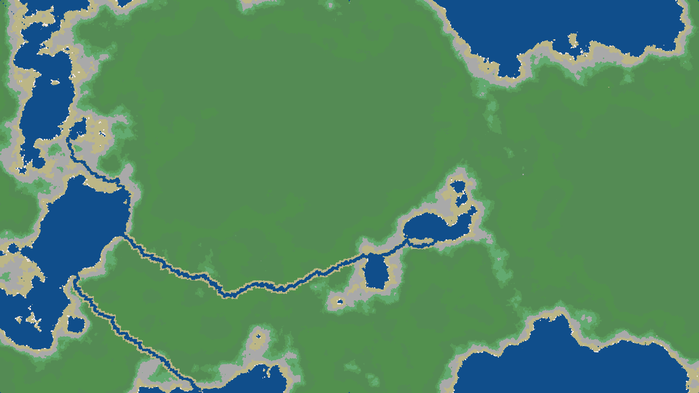

# grid-engine

## Description

**gridengine** is a framework for generating and manipulating grids. It provides a number of classes and functions for generating and manipulating grids. Each grid is composed of [Cell](#Cell) objects and is defined by a [Blueprint](#Blueprint). A grid can be generated from a blueprint, loaded from a file, or created manually. It can also be pickled for later use. It can be rendered as a 2D image, an animated GIF or an ASCII string. Grids provide a number of relevant methods for pathfinding, cell manipulation, and more.

## Installation

To install **gridengine**, run the following command:

    ```bash
    pip install grid_engine
    ```

## Usage

To use **gridengine** you can import any number of the submodules and utilize its respective features.

    ```python
    import gridengine
    from gridengine import grid
    
    # Create a grid
    grid = grid.Grid(cell_size=10, grid_dimensions=(1000, 1000))
    
    # Save a grid
    grid.save_grid()
    
    # Load a grid
    loaded_grid = grid.Grid.load_grid(1)
    ```

grid-engine also provides a command line interface. To use it, run the following command:

    ```bash
    python -m grid_engine --help

    # Output:
    # usage: gridengine [-h] [-i] [-b BLUEPRINT] [--ascii] [-l LOAD] [-t] [-ns NOISE_SCALE] [-no NOISE_OCTAVES] [-nr NOISE_ROUGHNESS] [-r ROWS] [-c COLUMNS] [-s SIZE] [-S] [-T TYPE] [-v]

    # Generate a visualized grid from a blueprint. For producing a blueprint, see the blueprint module.

    # options:
    #   -h, --help            show this help message and exit
    #   -i, --interactive     Run an interactive session
    #   -b BLUEPRINT, --blueprint BLUEPRINT
    #                         Load a blueprint from a file
    #   --ascii               Print the grid as ascii
    #   -l LOAD, --load LOAD  Load a grid from a file
    #   -t, --terrain         Whether to generate terrain with the grid.
    #   -ns NOISE_SCALE, --noise-scale NOISE_SCALE
    #                         Noise scale
    #   -no NOISE_OCTAVES, --noise-octaves NOISE_OCTAVES
    #                         Noise octaves
    #   -nr NOISE_ROUGHNESS, --noise-roughness NOISE_ROUGHNESS
    #                         Noise roughness
    #   -r ROWS, --rows ROWS  Number of rows in the grid
    #   -c COLUMNS, --columns COLUMNS
    #                         Number of columns in the grid
    #   -s SIZE, --size SIZE  Size of each cell in the grid
    #   -S, --save            Save the grid object to a file
    #   -T TYPE, --type TYPE  Type of file to save the grid as
    #   -v, --verbose         Verbose output
    ```

# Examples

The following examples demonstrate the use of the grid-engine package.

### CLI

The following command:

    ```bash
    python -m grid_engine -v -S -t -ns 400 -no 75 -nr 0.55 -r 450 -c 800 -s 2
    ```

Will produce the following output:

    ```bash
    Generating blueprint with cell size 2, 450 rows and 800 columns. Total_cells: 360000 ...
    Success! Blueprint generated. Dimensions: (1600, 900)
    Building grid from blueprint ...
    Finding landmasses ...
    Separating islands from landmasses ...
    done
    Finding start to river ...
    Found largest landmass: 0 with 302951 cells
    Finding lake coastal cells ...
    Found 1094 cells.
    Validating start/end of river ...
    Start cell: pd00229(445, 228), End cell: dq00087(146, 86))
    Building river ...
    Getting river cells by walk ...
    Generating river with end designated ...
    Cells in river: 300 | Current cell: kb00082 | Next cell: kc00082
    River steps: 300
    Found largest landmass: 0 with 302951 cells
    Finding lake coastal cells ...
    Found 1094 cells.
    Validating start/end of river ...
    Start cell: ip00499(275, 498), End cell: dv00087(151, 86)
    Building river ...
    Getting river cells by walk ...
    Generating river with end designated ...
    Cells in river: 757 | Current cell: dz00082 | Next cell: ea000814
    River steps: 757
    done
    Success! Grid generated.
    Pickling grid ...
    Success!
    Pickling blueprint ...
    Success!
    Generating grid image ...
    Importing pillow ...
    Preparing raw image ...
    Counting cells ...
    Total cells: 360000
    Shuffling cells ...
    Cells drawn. 100%
    Saving grid image ...
    Grid ID: 8d564
    ```

The following image is the result of the above command:


*The river generation algorithm is not perfect. I am currently working on improving it.*

The above command will also produce the following files(Not included in the repository... That is, generate your own!):

* `grid.8d564.pickle`: A pickled Grid object.
* `blueprint.8d564.pickle`: A pickled TerrainGridBlueprint object.

    ```python
    import grid_engine
    from grid_engine import Grid

    # Load the 8d564 grid(assuming you've not generated any other grids)
    _8d564 = Grid.load_grid('8d564')

    print(_8d564.grid_id)
    # output: 'fb16965aa77f44138dd6149b823ee9e4'

    # Get a random cell
    cellA = _8d564.random_cell(attr=('passable', True))

    # Get another
    cellB = _8d564.random_cell(attr=('passable', True))

    # Get a path from cellA to cellB
    path, cost = _8d564.get_path(cellA, cellB)
    print(path)
    ```
