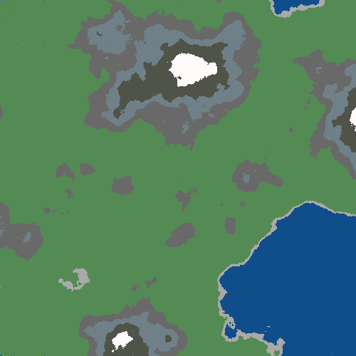

# grid-engine

## Description

The **grid-engine** package provides classes for generating and manipulating grids. The grid-engine package is divided into two subpackages: **grid blueprint** and **grid**. The **grid blueprint** subpackage provides classes for generating and manipulating blueprints, which are the foundation of Grid objects created using this module. The **grid** subpackage provides classes for generating and manipulating Grid objects, which are the foundation of the grid engine.

## Usage

To use this package, import the necessary classes and functions. Here's an example:

```python
import grid_engine
from grid_engine import grid

# Create a grid
grid = grid.Grid(cell_size=10, grid_dimensions=(1000, 1000))

# Save a grid
grid.save_grid()

# Load a grid
loaded_grid = grid.Grid.load_grid(1)
```

grid-engine also provides a command line interface. To use it, run the following command:

```bash
python -m grid_engine --help

# Output:
# usage: grid [-h] [-i] [-b BLUEPRINT] [--ascii] [-l LOAD] [-t] [-ns NOISE_SCALE] [-no NOISE_OCTAVES] [-nr NOISE_ROUGHNESS] [-r ROWS] [-c COLUMNS] [-s SIZE] [-S] [-T TYPE] [-v]

# Generate a visualized grid from a blueprint. For producing a blueprint, see the blueprint module.

# options:
#   -h, --help            show this help message and exit
#   -i, --interactive     Run an interactive session
#   -b BLUEPRINT, --blueprint BLUEPRINT
#                         Load a blueprint from a file
#   --ascii               Print the grid as ascii
#   -l LOAD, --load LOAD  Load a grid from a file
#   -t, --terrain         Whether to generate terrain with the grid.
#   -ns NOISE_SCALE, --noise-scale NOISE_SCALE
#                         Noise scale
#   -no NOISE_OCTAVES, --noise-octaves NOISE_OCTAVES
#                         Noise octaves
#   -nr NOISE_ROUGHNESS, --noise-roughness NOISE_ROUGHNESS
#                         Noise roughness
#   -r ROWS, --rows ROWS  Number of rows in the grid
#   -c COLUMNS, --columns COLUMNS
#                         Number of columns in the grid
#   -s SIZE, --size SIZE  Size of each cell in the grid
#   -S, --save            Save the grid object to a file
#   -T TYPE, --type TYPE  Type of file to save the grid as
#   -v, --verbose         Verbose output
``````



